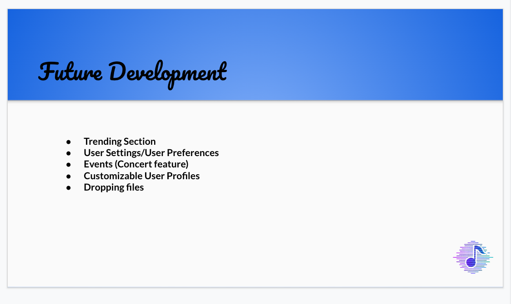

## VINYL Social media App - Interactive MERN Stack Single-Page Application

## Your Task

Collaborate with a group of developers to create an application that solves real-world problems.

### User Story

```
As a Music Lover
I want an application
Where I can find other people that enjoy the same music as I do as well as
Connect with other People and genres I am unfamiliar with

```

### Acceptance criteria

```
Use React for the front end.

Use GraphQL with a Node.js and Express.js server.

Use MongoDB and the Mongoose ODM for the database.

Use queries and mutations for retrieving, adding, updating, and deleting data.

Be deployed using Heroku (with data).

Have a polished UI.

Be responsive.

Be interactive (i.e., accept and respond to user input).

Include authentication (JWT).

Protect sensitive API key information on the server.

Have a clean repository that meets quality coding standards (file structure, naming conventions, best practices for class and id naming conventions, indentation, high-quality comments, and so on).

Have a high-quality README (with unique name, description, technologies used, screenshot, and link to deployed application).
```

### Developers

Ryan Sheridan - Backend

Mohamed Aden - Backend

Muhammet Toklu - Backend

Drew Isaacs - Frontend

Omar Yassine - Frontend

### Deployed Application ⤵️

[Vinyl App](https://github.com/NightlineCoder/Vinyl-Social-Media)


